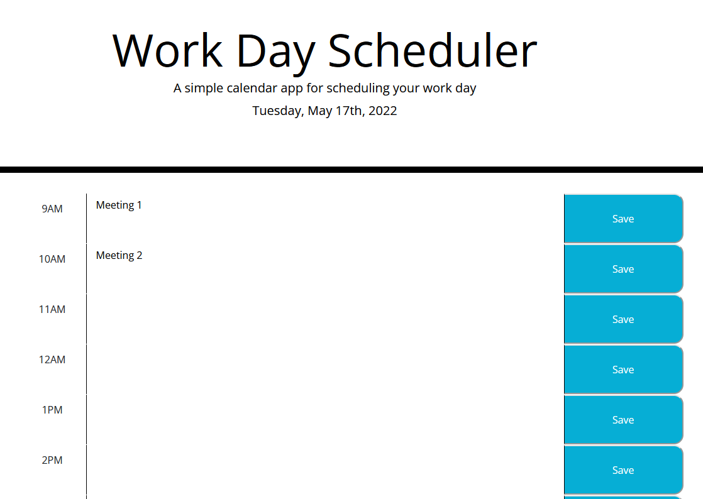

# Work Day Scheduler

Challenge 5-- Work Day Scheduler

    Created via VSCode

    Utilizing moment.js and javascript to create a work-day scheduler to keep track of the day whilst being able to save on local storage

    So, when a refresh is made the saved events persists on the page

Project found on [Github](https://github.com/TristinNguyen/Work_Day_Scheduler)

